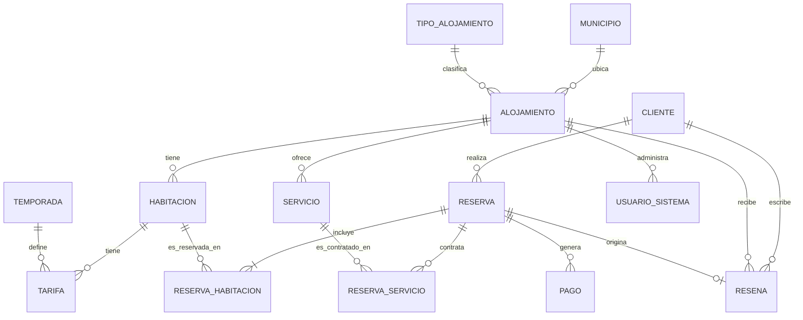

# TurismoUQ — Modelo de datos (Entrega 1)

## 1. Diagrama entidad-relación



Nota de nomenclatura: la entidad **RESEÑA** del enunciado se implementa como tabla `RESENA` (sin tilde) para evitar problemas de charset/collation entre distintas instalaciones de Oracle XE. Es la misma entidad, documentado aquí para la sustentación.

## 2. Diccionario de entidades (resumen)

| Entidad | Rol en el modelo |
|---|---|
| MUNICIPIO | Catálogo de los 12 municipios del Quindío |
| TIPO_ALOJAMIENTO | Catálogo: finca cafetera, hotel, glamping, hostal |
| ALOJAMIENTO | Propiedad concreta, ubicada en un municipio, de un tipo |
| HABITACION | Unidad reservable dentro de un alojamiento |
| TEMPORADA | Ventana de fechas concreta (por año) con un tipo BAJA/MEDIA/ALTA |
| TARIFA | Precio por noche de una habitación durante una temporada |
| CLIENTE | Persona que reserva |
| RESERVA | Encabezado de una reserva (cliente, fechas, estado, total) |
| RESERVA_HABITACION | Detalle: qué habitaciones incluye una reserva |
| PAGO | Pagos asociados a una reserva |
| SERVICIO | Catálogo de servicios complementarios de un alojamiento |
| RESERVA_SERVICIO | Detalle: qué servicios contrató una reserva |
| RESENA | Calificación/comentario de un cliente sobre un alojamiento |
| USUARIO_SISTEMA | Cuentas de acceso a la BD (recepción, admin, gerente, auditor) |

El detalle de atributos, tipos, PK/FK/CHECK vive en el script [`01_ddl/02_tablas.sql`](../01_ddl/02_tablas.sql) — es la fuente de verdad; este documento explica el *porqué* de las decisiones, no repite el DDL.

## 3. Decisión de diseño 1 — Una reserva con varias habitaciones

**Problema:** una familia puede reservar 2-3 habitaciones del mismo alojamiento para las mismas fechas, dentro de una sola reserva (un solo cliente responsable, un solo estado, un solo total).

**Modelo elegido:**

```
RESERVA (1) ----< RESERVA_HABITACION >---- (1) HABITACION
```

- `RESERVA` guarda el encabezado: cliente, fecha de reserva, checkin/checkout, estado, valor_total.
- `RESERVA_HABITACION` es la tabla asociativa (N:M) con PK compuesta `(id_reserva, id_habitacion)`. Cada fila guarda `num_huespedes` y `valor_estadia`, que es el valor calculado para *esa* habitación en el rango de fechas de la reserva.
- `RESERVA.valor_total` es la suma de `RESERVA_HABITACION.valor_estadia` más los servicios contratados (`RESERVA_SERVICIO`); se mantiene consistente vía `sp_crear_reserva` (Entrega 2).

**Por qué no otras opciones:**
- Repetir una fila de `RESERVA` por habitación duplicaría cliente/fechas/estado y rompería la idea de "una reserva, un pago" — más difícil de facturar y de cancelar como unidad.
- Guardar una lista de habitaciones en una sola columna (CSV/JSON) violaría 1FN e impediría hacer JOIN, FK reales o `SELECT ... FOR UPDATE` por habitación (necesario en la Entrega 3 para bloquear una habitación específica).

**Por qué `valor_estadia` se guarda en `RESERVA_HABITACION` y no se recalcula siempre:** las tarifas cambian con el tiempo (auditoría de TARIFA en Entrega 2); si no se guarda un snapshot al momento de crear la reserva, el histórico de reservas pasadas cambiaría de valor cada vez que cambia una tarifa vigente. Guardar el snapshot es lo que hace correcto el reporte de "ingresos históricos" de la Entrega 1.

## 4. Decisión de diseño 2 — Estadía que cruza dos temporadas

**Problema:** un cliente puede reservar del 28 de diciembre al 3 de enero, cruzando la temporada "Diciembre-Enero (Alta)" del año que termina con la del año que empieza; o del 10 al 16 de abril, cruzando "Semana Santa (Alta)" con días normales de "Baja". `fn_valor_estadia` (Entrega 2) debe cobrar cada noche a la tarifa de la temporada a la que pertenece, no una sola tarifa para toda la estadía.

**Modelo elegido:**

- `TEMPORADA` no es una regla recurrente abstracta ("todos los abriles"), sino **filas concretas con fecha_inicio/fecha_fin de un año determinado** (ej. `Semana Santa 2025`, 2025-04-13 a 2025-04-20). Esto evita tener que calcular en PL/SQL "en qué semana cae Semana Santa este año" — esa lógica de calendario ya quedó resuelta al cargar los datos.
- Las temporadas de un mismo año **particionan el calendario completo sin huecos**: donde no hay Semana Santa, mitad de año, puente o diciembre-enero, se genera una fila `BAJA` que cubre esos días. Así siempre existe una tarifa para cualquier noche posible.
- `TARIFA (id_habitacion, id_temporada) → valor_noche` es única por combinación habitación+temporada.

**Algoritmo de `fn_valor_estadia(id_habitacion, fecha_in, fecha_out)`:**
1. Buscar todas las `TEMPORADA` cuyo rango se solapa con `[fecha_in, fecha_out)`: `fecha_inicio < fecha_out AND fecha_fin >= fecha_in`.
2. Para cada una, calcular las noches que realmente caen dentro de la estadía: `noches = LEAST(fecha_out, fecha_fin + 1) - GREATEST(fecha_in, fecha_inicio)`.
3. Multiplicar `noches * TARIFA.valor_noche` (de esa habitación en esa temporada) y sumar sobre todas las temporadas solapadas.

Esto es exactamente lo que se necesita para la Entrega 2, y ya se valida en la Entrega 1 durante la carga de datos (se usa la misma lógica, en una función local del script de carga, para fijar `valor_estadia` de cada `RESERVA_HABITACION`).

## 5. Tablespace propio para el histórico de reservas

Se crea `TS_HISTORICO_RESERVAS` y se colocan ahí las tablas transaccionales que crecen mes a mes con la operación: `RESERVA`, `RESERVA_HABITACION`, `PAGO`, `RESERVA_SERVICIO` (juntas concentran los ~25.000 + ~40.000 registros del volumen mínimo, y seguirán creciendo con el tiempo). Las tablas catálogo/maestras (`MUNICIPIO`, `TIPO_ALOJAMIENTO`, `ALOJAMIENTO`, `HABITACION`, `TEMPORADA`, `TARIFA`, `CLIENTE`, `SERVICIO`, `USUARIO_SISTEMA`, `RESENA`) quedan en el tablespace por defecto (`USERS`).

**Justificación:**
- **Backup/recuperación independientes:** se puede respaldar el histórico de reservas con una política distinta (ej. más frecuente, o en modo solo-lectura para años cerrados) sin tocar el catálogo.
- **Monitoreo de espacio aislado:** el crecimiento fuerte (miles de filas/mes) no se mezcla con las tablas pequeñas y casi estáticas del catálogo, facilitando detectar cuándo el histórico necesita más espacio.
- **Preparación para ILM:** a futuro, reservas de años cerrados (ej. 2024) se podrían mover a un tablespace de solo lectura o almacenamiento más económico, sin reorganizar el resto del modelo.
- **Aislar contención de E/S:** las escrituras constantes de reservas/pagos no compiten por los mismos bloques con las lecturas frecuentes de catálogo (municipios, tipos, tarifas) que casi no cambian.

## 6. Volumen de datos y su origen

Los datos se generan con PL/SQL + `DBMS_RANDOM` (ver [`02_carga_datos/`](../02_carga_datos/)), no se insertan a mano ni se importan de un CSV externo, para que la carga completa sea reproducible desde una base limpia con solo correr los scripts en orden.
